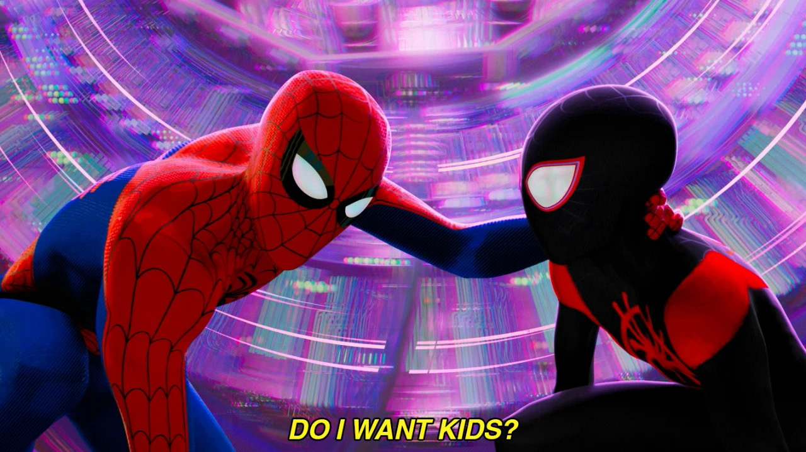
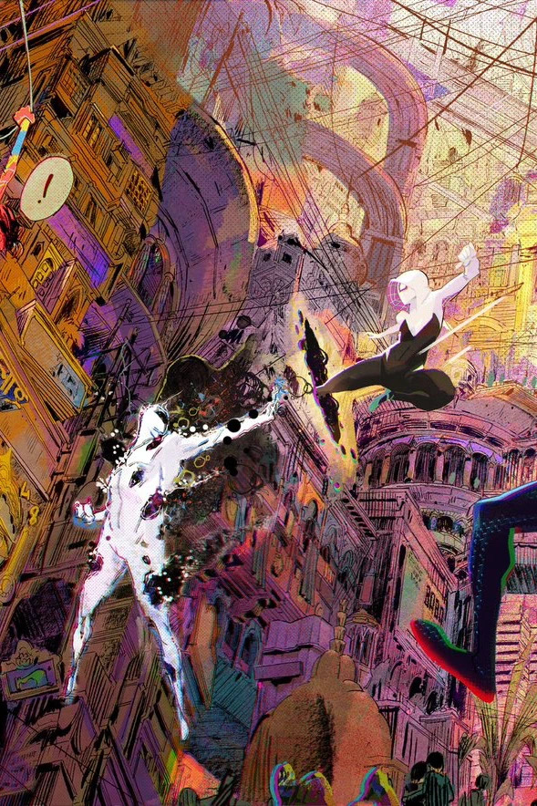
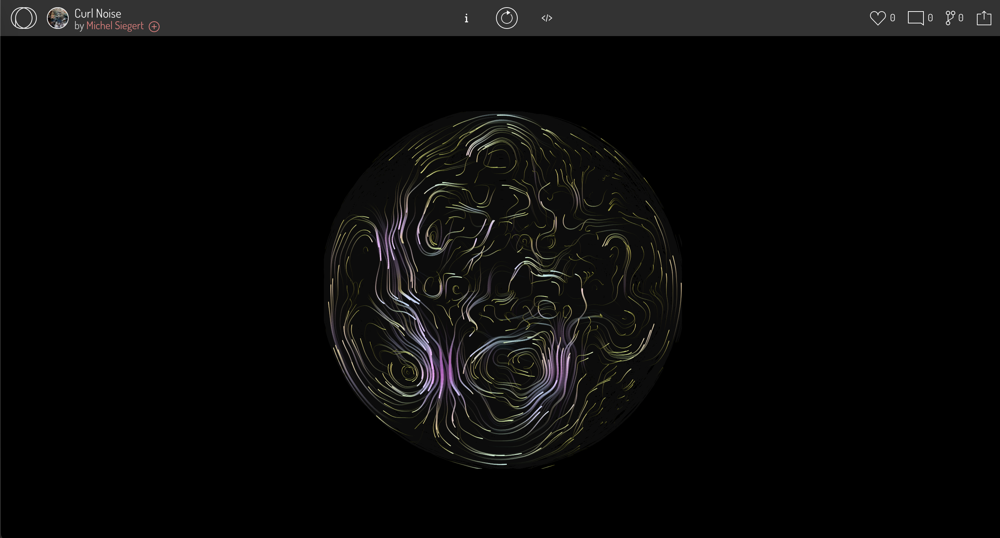
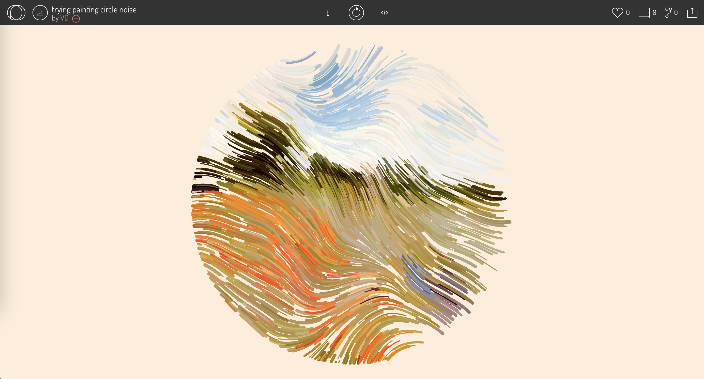
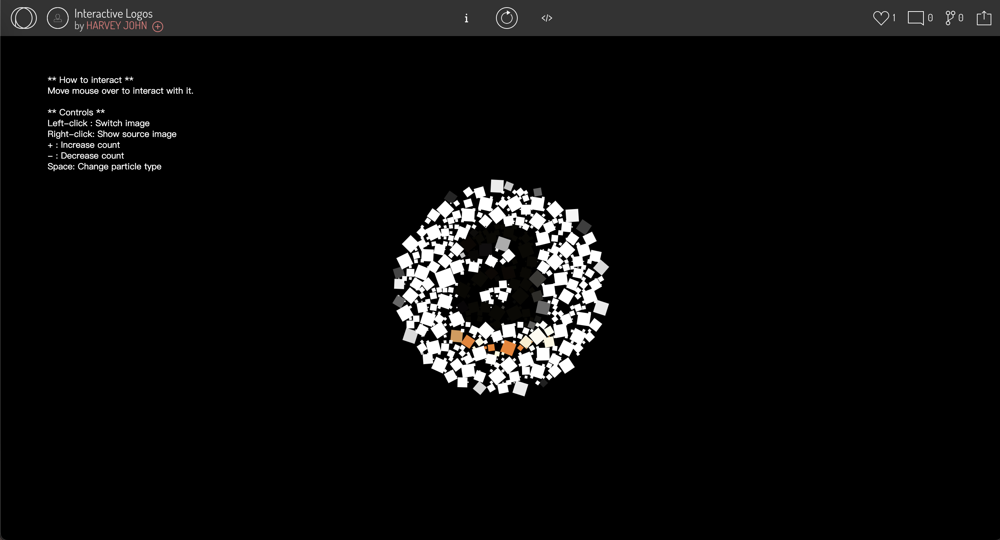
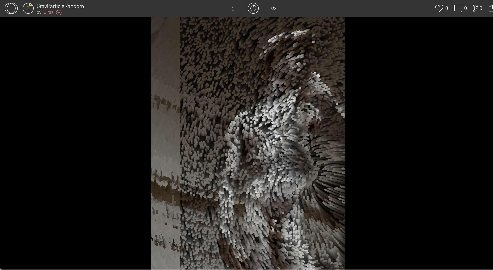

###
*xzho4299_9103_tut4*
## Quiz 8
### Part 1: Imaging Technique Inspiration
My inspiration comes from the animated movie ***Spider-Man: Across the Spider-Verse***. The movie uses a large number of hand-drawn lines to express a sense of flow, which brings strong visual impact and artistic beauty. The work I want to choose is ***Georges Majeur au Crépuscule*** by Monet. The picture looks like it is made up of many lines, which has a very similar feeling to ***Spider-Man***. I hope to give this painting the sense of flow in the movie and make the artwork full of vitality.
###

### Part 2: Coding Technique Exploration
The coding technique I found that can express the flow of lines is Particle System. 

[Particle Systems-example-1](https://openprocessing.org/sketch/2006924)

I need to redraw the image using the particle system. The basic method is to convert the image into particles: mainly to obtain the color of the image, then draw particles of different colors, and finally let the particles move to draw flowing graphics. 

[Particle Systems-example-2](https://openprocessing.org/sketch/2013546)

 In addition to showing the fluidity of the lines, I also want to add interactive effects with the mouse and keyboard, so that the particles can follow the movement of the mouse, increase or decrease the number of particles, change the particle type, and even achieve a three-dimensional effect with shadows.

[Particle Systems-example-3](https://openprocessing.org/sketch/1984312)

[Particle Systems-example-4](https://openprocessing.org/sketch/1960926)